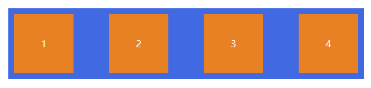

# 基本概念

采用 Flex 布局的元素，称为 Flex 容器（flex container），简称"容器"。它的所有子元素自动成为容器成员，称为 Flex 项目（flex item），简称"项目"。 

*注意，设为 Flex 布局以后，子元素的`float`、`clear`和`vertical-align`属性将失效。*

容器默认存在两根轴：

- 水平的主轴(`main axis`)
- 垂直的交叉轴(`cross axis`)

主轴的开始位置（与边框的交叉点）叫做(`main start`)，结束位置叫做(`main end`)

交叉轴的开始位置叫做(`cross start`)，结束位置叫做(`cross end`)

项目默认沿主轴排列。单个项目占据的主轴空间叫做`main size`，占据的交叉轴空间叫做`cross size`

# 容器的属性

- `flex-direction`
- `flex-wrap`
- `flex-flow`
- `justify-content`
- `align-items`
- `align-content`

## flex-direction

`flex-direction`属性决定主轴的方向（即项目排列的方向）

属性值如下：

- `row`(默认值)：主轴为水平方向，起点在左端

- `row-reverse`：主轴为水平方向，起点在右端

- `column`：主轴为垂直方向，起点在上沿

- `column-reverse`：主轴为垂直方向，起点在下沿

## flex-wrap

默认情况下，项目都排在一条线（又称"轴线"）上。`flex-wrap`属性定义，如果一条轴线排不下，如何换行。

属性值如下：

- `nowrap`（默认）：不换行

- `wrap`：换行，第一行在上方

- `wrap-reverse`：换行，第一行在下方

## flex-flow

`flex-flow`属性是`flex-direction`属性和`flex-wrap`属性的简写形式，默认值为`row nowrap`

`flex-flow: <flex-direction> || <flex-wrap>`

## justify-content

`justify-content`属性定义了项目在主轴上的对齐方式。

它可能取5个值，具体对齐方式与轴的方向有关。下面假设主轴为从左到右。

- `flex-start`（默认值）：左对齐

- `flex-end`：右对齐

- `center`：居中

- `space-between`：两端对齐，项目之间的间隔都相等

- `space-around`：每个项目两侧的间隔相等。所以，项目之间的间隔比项目与边框的间隔大一倍。

## align-items

`align-items`属性定义项目在交叉轴上如何对齐。

它可能取5个值。具体的对齐方式与交叉轴的方向有关，下面假设交叉轴从上到下。

- `flex-start`：交叉轴的起点对齐
- `flex-end`：交叉轴的终点对齐
- `center`：交叉轴的中点对齐
- `baseline`：项目的第一行文字的基线对齐
- `stretch`（默认值）：如果项目未设置高度或设为auto，将占满整个容器的高度。

## align-content

`align-content`属性定义了多根轴线的对齐方式。如果项目只有一根轴线，该属性不起作用。

该属性可能取6个值。

- `flex-start`：与交叉轴的起点对齐
- `flex-end`：与交叉轴的终点对齐
- `center`：与交叉轴的中点对齐
- `space-between`：与交叉轴两端对齐，轴线之间的间隔平均分布
- `space-around`：每根轴线两侧的间隔都相等。所以，轴线之间的间隔比轴线与边框的间隔大一倍
- `stretch`（默认值）：轴线占满整个交叉轴