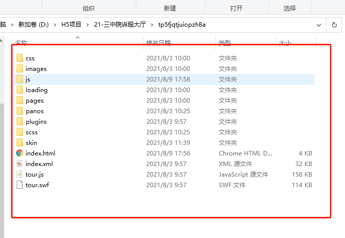

- [安装Nginx](#安装nginx)
- [项目配置](#项目配置)
- [关闭默认占用的80端口](#关闭默认占用的80端口)
- [重启nginx服务](#重启nginx服务)
- [访问IP地址出现 H5网页](#访问ip地址出现-h5网页)
# 安装Nginx

> 以Ubuntu为例

- 安装
```
sudo yum -y install nginx
```

- 查看nginx版本
```
nginx -v
```
出现版本号表示成功


- 自定义配置文件

Nginx默认配置文件在`/etc/nginx/nginx.conf`文件中，可已将自定义的配置文件放入`/etc/nginx/conf.d/`目录下

使用vim编辑自定义`servers.conf`配置文件
```
sudo vim /etc/nginx/conf.d/servers.conf
```

```
// 写入以下内容
server {
  listen 80;
  server_name localhost;

  location / {
    root /mnt/d/linux/test  // 此处填入项目存放的位置
    index index.html;
    autoindex on;
  }
}
```

- 检查配置文件是否正确

```
sudo nginx -t
```
以下表示成功


- 启动nginx

```
sudo systemctl start nginx
```

启动成功后通过浏览器访问IP地址出现：


- 常用`nginx`命令
  - 启动Nginx：`sudo systemctl start nginx`
  - 重启Nginx: `sudo systemctl restart nginx`
  - 查看Nginx服务状态: `sudo systemctl status nginx`

# 项目配置

将项目文件放入`/mnt/d/linux/test`(配置文件中填写的路径)

将之前给的H5项目文件放入对应的文件夹放入`/mnt/d/linux/test`路径中

*注意：index.html一定要放在根目录，比如test文件夹中，包含了以下文件*




# 关闭默认占用的80端口

```
sudo vim /etc/nginx/sites-enabled/default
```


# 重启nginx服务

`sudo systemctl restart nginx`

# 访问IP地址出现 H5网页