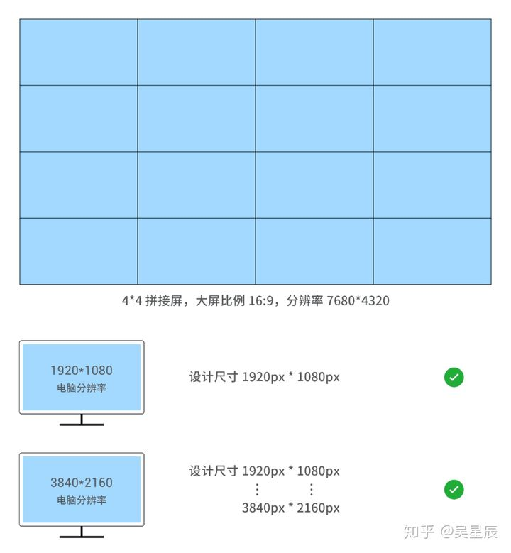
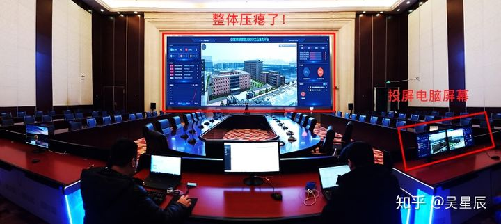
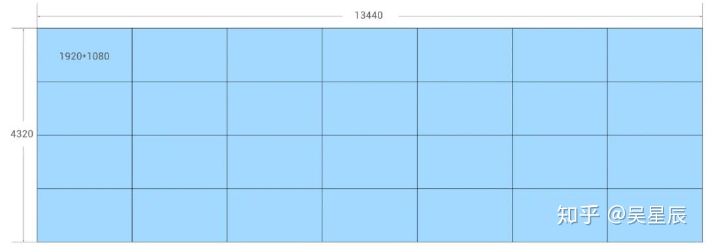
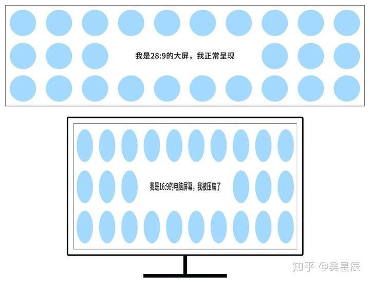
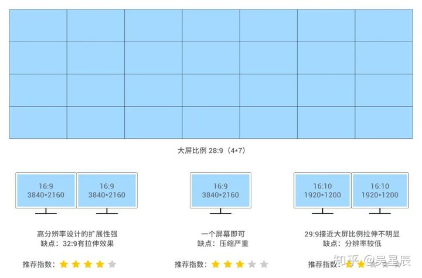
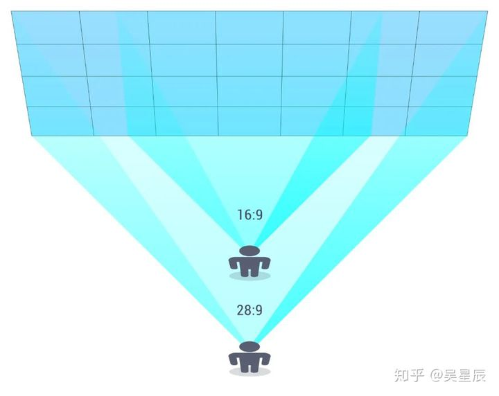
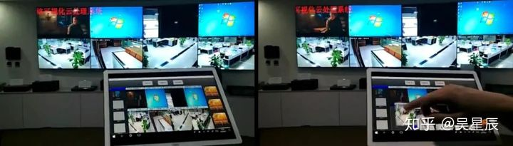
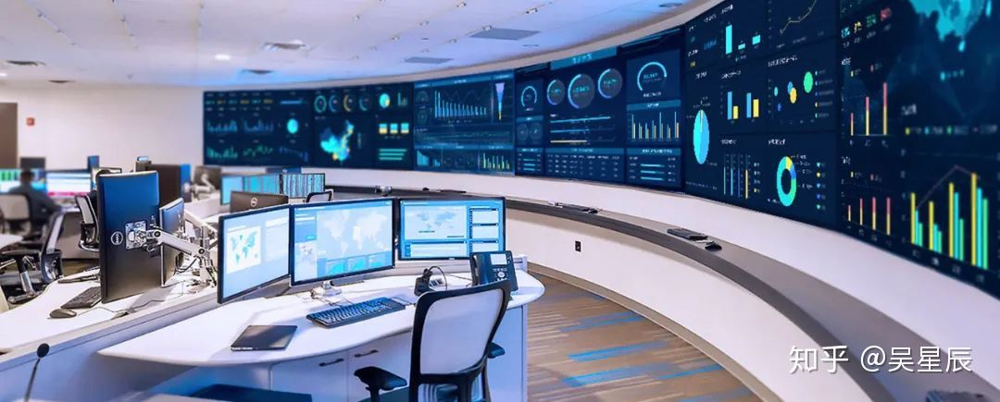

[参考地址](https://zhuanlan.zhihu.com/p/122570290)

# 大屏的类别及成像

## 大屏分类

1. 拼接屏：由46-55寸的液晶显示屏拼接而成，有一定的缝隙
2. LED屏无缝隙：是由成千上万个LED灯构成像素点，发光像素点之间的距离是LED显示屏的规格，用P值表示，P值越小成像越优秀细腻，对大屏类别的了解，有助于计算设计尺寸及比例。

## 大屏成像原理

大屏成像原理几乎都是投屏，也就是把电脑屏幕通过有线信号投放到大屏上，电脑上呈现什么内容，大屏上就会呈现什么内容。在电脑上的交互操作大屏会同步进行，这就是投屏。

> 总结：“电脑上呈现什么内容，大屏上就会呈现什么内容”，所以电脑上出现滚条是绝对不可以的。

# 大屏和电脑同比例设计

首先要强调一点，不可以以大屏的分辨率定义设计稿尺寸，当大屏的比例和电脑屏幕的比例一样时，要结合电脑屏幕的分辨率来定设计稿尺寸。

比如电脑屏幕分辨率为1920 * 1080，那设计稿就可以是这个尺寸，当电脑屏幕是3840 * 2160（4K）屏时，可以用1920～3840*1080～2160同等比例任意数值。

当电脑是4k分辨率时，虽然设计稿用1920 * 1080的设计尺寸也可以实现，但最终在大屏的呈现画面清晰度不够高。

原因是开发人员用1920 * 1080适配了4k分辨率，这本身就是同比放大关系，再加上投放中的画质损失就会更明显，不过基本上也是可以接受的范围内。

虽然画质影响不大，但优先级上更推荐电脑本身的分辨率3840*2160作为设计稿尺寸，这样1比1的呈现最能保证画面质量。前端开发上只需要按尺寸固定写即可。

大分辨率的设计尺寸还有个优势就是可以呈现更多的内容，同时在设计上的字号也要相对更大，比如1920上面16px字号，3840最好也能做到两倍左右的放大。

> 当大屏电脑比例一致，电脑屏幕分辨率为1920 * 1080时，设计稿为电脑分辨率尺寸大小；
> 分辨率为3840 * 2160时设计稿优先级是3840 * 2160、1920 * 1080、之间同比例数值，当小于电脑分辨率时开发方式要适应屏幕大小。

# 大屏和电脑不同比例设计

当大屏和电脑屏幕是不同比例时，牢记一点，一定要**保证大屏的展示是正常的**，这是必须的。

分享一个反例，看下图，投屏电脑是由两块16:9的屏幕组成的32:9比例的显示屏，大屏大概是20:9的比例。

现在大屏的内容呈现是压瘪状，尤其饼图已经成椭圆形，问题不再开发，而是设计。

反面案例

原因是设计师的设计尺寸按32:9设计，在电脑上呈现1:1没有任何问题，投放到大屏上比例压到20:9，因为投放关系页面上所有的元素都会呈现压瘪状态。

改正的方法就是按大屏的比例设计，保证大屏的正常呈现，电脑上差点无关紧要。

本案例中两台显示器组成32:9的屏幕投放并非是最优的方案，接下来用一个案例来详细解析。

## 案例解析

一个4 * 7的拼接大屏，分比率13440 * 4320，比例为28:9，如何给配置最合适的电脑比例屏幕投屏？

其实能找到28:9的最佳，但据我了解比较困难，我也咨询很多这方面的公司，没有定制显示器比例的服务。

所以就要找最接近的这个比例的显示器，在某电商平台查了个遍，最常见的有以下比例显示器：

1、16:9（1920 * 1080）

2、16:9（3840 * 2160）

3、16:10（1920 * 1200）

4、21:9（3440 * 1440）

其实根据我们上面的结论，大分辨率的电脑显示器扩展性更强，所以首先考虑4k大分辨率显示器，但16:9与28:9相差过大，如下图所示：

这样的一个压缩程度在操作会存在一些问题，例如有交互的大屏，很小的按钮就会被压的很瘪，导致点击的精准度下降，影响操作体验。

下图所示，用两个屏幕组合成一个屏幕称为32:9的比例，这样是较为接近28:9，所以最为合适。

虽然两个16:10的显示器比例为28:9最为接近，但分辨率过低，没有很强的扩展性。

所以前一章节分享的反例，20:9的大屏用16:9的显示器更为合适，因为16:9更接近大屏的比例。

> 总结：
> 1. 要以大屏的比例去定义设计稿，保证大屏完美呈现
> 2. 4K分辨率电脑，优先使用大分辨率作为设计稿
> 3. 用最接近大屏分辨率的电脑屏幕比例投放

# 重要知识点解析

下面要讲的非常重要，就是大屏的字号使用问题，因为字号返工是一件非常恐怖的事（经验之谈），可能需要改样式，甚至重新设计都不为过。

我们都知道大屏的开发本身就是基于web端，网页中最小字号为12px，但这个字号在大屏中会显的很小。

因为大屏本身很大，观者需要站在较远地方才能看全貌，所以在字号上最好能相对大一点。

当然也是针对重要信息的文字，一些图表刻度尺的数值，装饰性的文字，小一些没有关系。

当大屏的比例较大时，字号也应该相应加大，看下图：

当大屏比例更宽时，观者就需要站在更靠后的位置，近大远小，字号和有些小元素需要相应加大，当然这需要根据实际场景而定。

我一直认为大屏设计，设计师需要去现场查看使用场景，考察观看位置，定义字号大小的运用；

考察室内环境，当室内的光线较强或较弱，需要用不同的颜色明度饱和度去尝试；

清楚了解大屏偏色情况，不同的品牌呈现的色调往往也是不一样的，这样最终才能营造一个相对舒适的大屏使用环境。

> 总结：
> 1. 大屏设计字号要相对使用大字号
> 2. 当大屏比例更大时，要相应的调整字号
> 3. 设计师对大屏的本身和使用环境考察

# 大屏的分屏设计

分屏是大屏很常见的展示方式，分屏方式一般有两种，一种是通过平板电脑软件控制分屏，在可视化的呈现领域中很少用到。

平板电脑软件控制大屏分屏

另一种方式与我们设计相关，是通过多个信号源控制大屏分屏，一个信号源连接一台电脑，所以在设计时，一台电脑的显示器就是一个设计稿。

这种情况通常出现在非常宽的大屏上，太宽的大屏就不太适用于多个电脑屏幕组成投屏，如下图由6个信号源组成的大屏。

> 总结：
> 
>每个信号源对应一张设计稿，n个信号源就是n张设计稿。